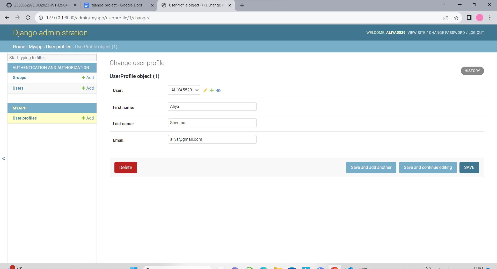

# Ex-04-Django-Models

NAME : ALIYA SHEEMA

REFERENCE NUMBER : 23005529

DEPARTMENT : AIDS
## AIM:
To create a django model.

## DESIGN PROCEDURE:
Django Models   

### Step 1 : Create django project and app using the following commands:

Django-admin startproject mymodels

Python manage.py startapp myapp

### Step 2: Create a user_profile models in model.py

Add the models in the admin interface using the code in admin.py

Write the function based view to render the data from the models to the template in view.py

Setup the url path for the templates using urls.py

In settings.py file add the app created.

### Step 3: Now do the migrations process to initiate and save the models 

Python mange.py makemigrations
Python manage.py migrate
Create a template as user_profiles.html

### step 4: Run the program using the command

Python manage.py runserver 8000

In the admin/ page you can view the models created

And  in the user_profile template page you can see the profile page of the user.

## OUTPUT:

## RESULT:
Thus the django model created successfully.